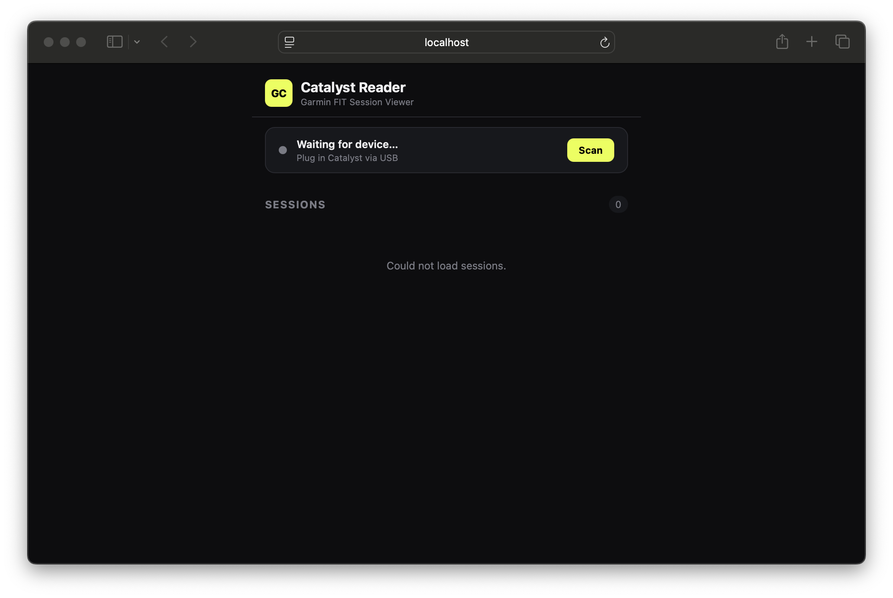

# Race Arena + Garmin Catalyst Reader

A lap-data analysis app for track drivers, with a built-in reader for the **Garmin Catalyst™ Driving Performance Optimizer**.

---

## Catalyst Reader



## What's inside

| Folder | What it does |
|---|---|
| `/` (root) | **Race Arena** — main web app for lap analysis, AI coaching, and session comparison |
| `catalyst/` | **Catalyst Reader** — local server that auto-imports FIT files off your Garmin Catalyst via USB |

---

## Catalyst Reader — Quick Start

### Prerequisites

- [Node.js](https://nodejs.org/) v18 or higher
- A Garmin Catalyst connected via USB **or** FIT files already copied to your Mac
- macOS (Linux works too; Windows untested)

### Install

```bash
cd catalyst
npm install
```

### Run

```bash
npm start
```

You'll see:

```
  Garmin Catalyst Reader
  ─────────────────────────────────
  Local:   http://localhost:4321
  Network: http://192.168.x.x:4321

  Plug in your Catalyst via USB to start importing.
```

Open **http://localhost:4321** in your browser (or on your iPhone using the Network URL).

---

## How to load data from your Garmin Catalyst

### Option A — USB (automatic)

1. Start the server (`npm start`)
2. Plug the Catalyst into your Mac with its USB-C cable
3. The app detects the device automatically within ~5 seconds
4. A scan runs — all `.fit` files are imported
5. Unplug. Sessions appear in the UI immediately.

> The device mounts as a USB drive. The app scans all known Garmin folder paths:
> `GARMIN/ACTIVITY/`, `GARMIN/SESSION/`, and the root of the volume.

### Option B — Manual import (USB, then drag-and-drop)

1. Plug in the Catalyst — it mounts as a drive in Finder
2. Navigate to `GARMIN/ACTIVITY/` on the volume
3. Copy the `.fit` files to `catalyst/sessions-import/` (create that folder)
   — or just click **Scan** in the UI after plugging in

### Option C — Already have `.fit` files?

Click the **Scan** button in the UI at any time. If the device is plugged in, it reads from it. You can also copy `.fit` files manually to `catalyst/sessions/` as pre-parsed JSON by running the scan while the device is mounted.

---

## Where sessions are saved

Parsed sessions are stored as JSON files in:

```
catalyst/sessions/<filename>.json
```

Each file contains:
- Session metadata (date, total time, distance, max speed)
- Per-lap breakdowns (lap number, time, speed)
- Downsampled GPS track (~500 points)
- Raw FIT events and coaching alerts (Catalyst-specific)

**These files are local only — nothing is uploaded anywhere.**
They are excluded from git (`.gitignore`) so your personal driving data stays private.

---

## Race Arena (main app)

The main web app is a Firebase-hosted application. To run it locally:

```bash
# From the repo root
npm install
```

Then open `index.html` in a browser, or use the Firebase emulator:

```bash
npm install -g firebase-tools
firebase emulators:start
```

---

## Tech stack

- **Catalyst Reader**: Node.js + Express + [`fit-file-parser`](https://github.com/jimmykane/fit-parser) + SSE for live updates
- **Race Arena**: Vanilla JS + Firebase (Auth, Firestore, Storage, Functions) + Chart.js

---

## Troubleshooting

**Device not detected**
- Make sure macOS has mounted it — it should appear in Finder as a drive
- Try clicking **Scan** manually
- Check that the volume name contains `GARMIN`, `CATALYST`, or `NO NAME`

**Port 4321 already in use**
```bash
PORT=5000 npm start
```

**FIT parse errors**
Some Catalyst firmware versions write non-standard FIT headers. The parser runs in `force: true` mode to handle these. If a file still fails, it'll be listed in the scan result with the error message.

---

## License

MIT
